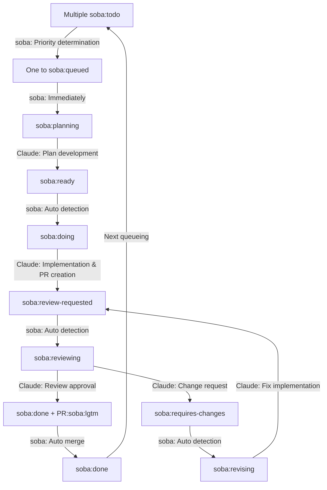

# soba - AI-Driven Development Workflow Automation

[](https://golang.org/)
[](LICENSE)

> **日本語版のREADMEは [こちら](README_ja.md) をご覧ください**

soba provides fully autonomous workflows using Claude Code.

## 🎯 Overview

soba automates the entire development workflow from planning to pull request merging.
It monitors GitHub Issues and automatically handles planning, implementation, review, and merge phases with Claude Code AI assistance.

### Key Features

- 🤖 **Autonomous Workflow**: Complete automation from issue creation to merge
- 🏷️ **Label-driven State Management**: Progress tracking via GitHub labels
- 🔄 **Continuous Processing**: Automatic polling and phase transitions
- 🎯 **Priority Management**: Sequential processing by issue number
- 🪟 **Tmux Integration**: Visual monitoring of AI processes
- 🔀 **Git Worktree Support**: Independent branch management
- 💭 **Slack Notifications**: Progress updates via Slack notifications
- 🚀 **Auto Merge**: Automatic PR merging after approval

## Workflow



Each phase is handled by Claude Code AI with full automation:
- **Plan**: Requirements analysis and implementation strategy
- **Implement**: Code generation and file modifications
- **Review**: AI-driven code review and quality assurance

## 🚀 Quick Start

### Prerequisites

- **Git 2.0+**
- **tmux 2.0+** (for session management)
- **GitHub CLI** (recommended) or GitHub token
- **Claude Code** installed and configured

### Installation

#### Quick Install (Recommended)

```bash
# Download and install the latest release
curl -L https://github.com/douhashi/osoba/releases/latest/download/soba_$(uname -s | tr '[:upper:]' '[:lower:]')_$(uname -m | sed 's/x86_64/x86_64/; s/aarch64/arm64/').tar.gz | tar xz -C /tmp && sudo mv /tmp/soba /usr/local/bin/
```

#### Alternative Installation Methods

```bash
# Build from source
git clone https://github.com/douhashi/soba.git
cd soba
go build -o soba cmd/soba/main.go

# Or install with Go
go install github.com/douhashi/soba/cmd/soba@latest
```

### Initial Setup

```bash
# Initialize configuration
soba init

# Configure GitHub authentication (recommended)
gh auth login

# Or set environment variable
export GITHUB_TOKEN="ghp_xxxxxxxxxxxx"

# Start the daemon
soba start
```

## 📋 Usage

### Basic Workflow

1. **Create a GitHub Issue** with clear requirements
2. **Add the `soba:todo` label** to trigger automation
3. **Monitor progress** through tmux sessions or GitHub updates
4. **Review the Pull Request** (optional - can be fully automated)

### CLI Commands

```bash
# Start the daemon (default: background mode)
soba start

# Start in foreground with verbose logging
soba start -f --verbose

# Check daemon status
soba status

# Stop the daemon
soba stop

# Display configuration
soba config

# Show logs
soba log
```

### Label-Based State Management

#### Issue Labels (State Management)

| Label | State | Description |
|-------|-------|-------------|
| `soba:todo` | Waiting | New issue, waiting for processing |
| `soba:queued` | Queue Selected | Selected as processing target |
| `soba:planning` | Planning | Claude is developing implementation plan |
| `soba:ready` | Ready | Planning complete, waiting for implementation |
| `soba:doing` | Implementing | Claude is working on implementation |
| `soba:review-requested` | Review Waiting | PR created, waiting for review |
| `soba:reviewing` | Reviewing | Claude is reviewing PR |
| `soba:done` | Complete | Review approved, ready for merge |
| `soba:requires-changes` | Change Required | Review determined fixes are needed |
| `soba:revising` | Fixing | Claude is addressing fixes |

#### PR Labels

| Label | Description |
|-------|-------------|
| `soba:lgtm` | Review approved, target for auto merge |

## ⚙️ Configuration

### Configuration File

soba uses `.soba/config.yml` for configuration:

```yaml
# GitHub settings
github:
  # Authentication method: 'gh', 'env', or omit for auto-detect
  # Use 'gh' to use GitHub CLI authentication (gh auth token)
  # Use 'env' to use environment variable
  auth_method: gh  # or 'env', or omit for auto-detect

  # Personal Access Token (required when auth_method is 'env' or omitted)
  # Can use environment variable
  # token: ${GITHUB_TOKEN}

  # Target repository (format: owner/repo)
  repository: douhashi/soba

# Workflow settings
workflow:
  # Issue polling interval in seconds (default: 20)
  interval: 20
  # Use tmux for Claude execution (default: true)
  use_tmux: true
  # Enable automatic PR merging (default: true)
  auto_merge_enabled: true
  # Clean up tmux windows for closed issues (default: true)
  closed_issue_cleanup_enabled: true
  # Cleanup interval in seconds (default: 300)
  closed_issue_cleanup_interval: 300
  # Command delay for tmux panes in seconds (default: 3)
  tmux_command_delay: 3

# Slack notifications
slack:
  # Webhook URL for Slack notifications
  # Get your webhook URL from: https://api.slack.com/messaging/webhooks
  webhook_url: ${SLACK_WEBHOOK_URL}
  # Enable notifications for phase starts (default: false)
  notifications_enabled: true

# Git settings
git:
  # Base path for git worktrees
  worktree_base_path: .git/soba/worktrees

# Logging settings
log:
  # Log file output path (default: .soba/logs/soba-{pid}.log)
  # ${PID} will be replaced with actual process ID at runtime
  output_path: .soba/logs/soba-${PID}.log
  # Number of log files to retain (default: 10)
  retention_count: 10
  # Log level: debug, info, warn, error (default: info)
  level: info
  # Log format: "text" or "json" (default: text)
  format: text

# Phase commands (optional - for custom Claude commands)
phase:
  plan:
    command: claude
    options:
      - --dangerously-skip-permissions
    parameter: '/soba:plan {{issue-number}}'
  implement:
    command: claude
    options:
      - --dangerously-skip-permissions
    parameter: '/soba:implement {{issue-number}}'
  review:
    command: claude
    options:
      - --dangerously-skip-permissions
    parameter: '/soba:review {{issue-number}}'
  revise:
    command: claude
    options:
      - --dangerously-skip-permissions
    parameter: '/soba:revise {{issue-number}}'
```

### Environment Variables

```bash
# GitHub authentication
export GITHUB_TOKEN="ghp_xxxxxxxxxxxx"

# Logging configuration
export SOBA_LOG_LEVEL="debug"
export SOBA_LOG_FORMAT="json"
```

## 🔧 Advanced Usage

### Monitoring and Debugging

```bash
# View daemon logs
soba log -f
```

## 🛠️ Development

### Building from Source

```bash
git clone https://github.com/douhashi/soba.git
cd soba
go mod download
make build
```

### Running Tests

```bash
make test
```

### Project Structure

```
soba/
├── cmd/soba/           # Main application entry point
├── internal/
│   ├── cli/            # CLI commands and interface
│   ├── config/         # Configuration management
│   ├── domain/         # Core business logic
│   ├── infra/          # External integrations
│   │   ├── github/     # GitHub API client
│   │   ├── tmux/       # tmux session management
│   │   └── slack/      # Slack notifications
│   └── service/        # Application services
├── docs/               # Documentation
└── .soba/             # Configuration templates
```

## 📄 License

This project is licensed under the MIT License - see the [LICENSE](LICENSE) file for details.

## 📞 Support

- 📚 **Documentation**: Check the `docs/` directory
- 🐛 **Issues**: [GitHub Issues](https://github.com/douhashi/soba/issues)