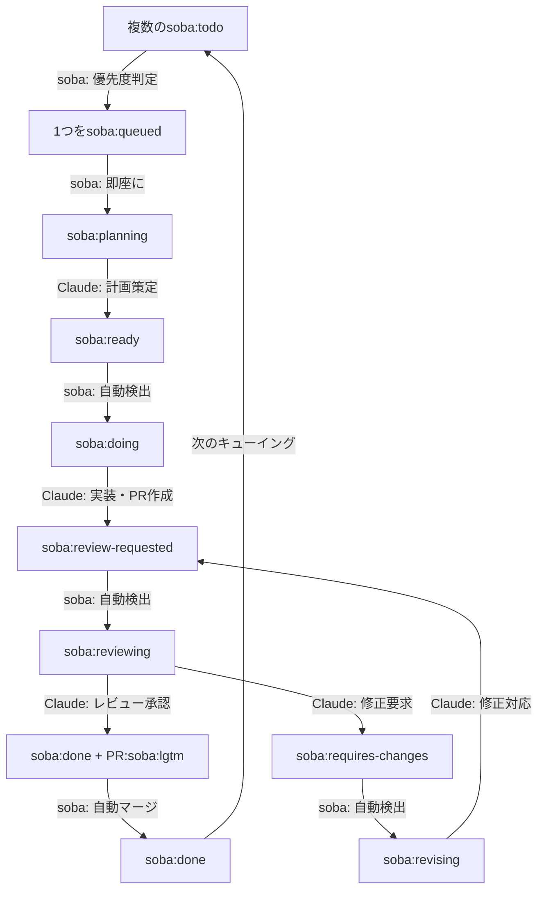

# soba - AI駆動開発ワークフロー自動化ツール

[](https://golang.org/)
[](LICENSE)

> **For English README, see [here](README.md)**

sobaはClaude Codeを利用して、完全自律的なワークフローを提供します。

## 🎯 概要

soba は計画からプルリクエストのマージまで、開発ワークフロー全体を自動化します。
GitHub Issueを監視し、Claude Code AIの支援により計画、実装、レビュー、マージの各フェーズを自動的に処理します。

### 主要な機能

- 🤖 **自律ワークフロー**: Issue作成からマージまで完全自動化
- 🏷️ **ラベル駆動の状態管理**: GitHubラベルによる進捗追跡
- 🔄 **継続的処理**: 自動ポーリングとフェーズ遷移
- 🎯 **優先順位管理**: Issue番号による順次処理
- 🪟 **Tmux統合**: AIプロセスの可視化監視
- 🔀 **Git Worktreeサポート**: 独立したブランチ管理
- 💭 **Slack通知**: 進捗状態をSlack通知
- 🚀 **自動マージ**: 承認後の自動PRマージ

## ワークフロー



各フェーズはClaude Code AIによる完全自動処理：
- **Plan**: 要件分析と実装戦略
- **Implement**: コード生成とファイル修正
- **Review**: AI駆動のコードレビューと品質保証

## 🚀 クイックスタート

### 前提条件

- **Git 2.0+**
- **tmux 2.0+** (セッション管理用)
- **GitHub CLI** (推奨) またはGitHubトークン
- **Claude Code** インストール・設定済み

### インストール

#### クイックインストール（推奨）

```bash
# 最新リリースをダウンロード・インストール
mkdir -p ~/.local/bin
curl -L https://github.com/douhashi/soba/releases/latest/download/soba_$(uname -s | tr '[:upper:]' '[:lower:]')_$(uname -m | sed 's/x86_64/x86_64/; s/aarch64/arm64/').tar.gz | tar xz -C /tmp && mv /tmp/soba ~/.local/bin/
```

#### その他のインストール方法

```bash
# ソースからビルド
git clone https://github.com/douhashi/soba.git
cd soba
go build -o soba cmd/soba/main.go

# またはGoでインストール
go install github.com/douhashi/soba/cmd/soba@latest
```

### 初期設定

```bash
# 設定ファイル初期化
soba init

# GitHub認証設定（推奨）
gh auth login

# または環境変数で設定
export GITHUB_TOKEN="ghp_xxxxxxxxxxxx"

# デーモン起動
soba start
```

## 📋 使用方法

### 基本ワークフロー

1. **GitHub Issue作成** - 明確な要件を記載
2. **`soba:todo`ラベル追加** - 自動化トリガー
3. **進捗監視** - tmuxセッションやGitHub更新を通じて
4. **Pull Requestレビュー** (オプション - 完全自動化可能)

### CLIコマンド

```bash
# デーモン起動（デフォルト: バックグラウンドモード）
soba start

# フォアグラウンドで詳細ログ付き起動
soba start -f --verbose

# デーモン状態確認
soba status

# デーモン停止
soba stop

# 設定表示
soba config

# ログを表示
soba log
```

### ラベルベース状態管理

#### Issueラベル（状態管理）

| ラベル | 状態 | 説明 |
|--------|------|------|
| `soba:todo` | 待機 | 新規Issue、処理待ち |
| `soba:queued` | キュー選択 | 処理対象として選択済み |
| `soba:planning` | 計画中 | Claudeが実装計画を策定中 |
| `soba:ready` | 準備完了 | 計画完了、実装待ち |
| `soba:doing` | 実装中 | Claudeが実装作業中 |
| `soba:review-requested` | レビュー待ち | PR作成済み、レビュー待ち |
| `soba:reviewing` | レビュー中 | ClaudeがPRをレビュー中 |
| `soba:done` | 完了 | レビュー承認済み、マージ可能 |
| `soba:requires-changes` | 修正要求 | レビューで修正が必要と判断 |
| `soba:revising` | 修正中 | Claudeが修正対応中 |

#### PRラベル

| ラベル | 説明 |
|--------|------|
| `soba:lgtm` | レビュー承認済み、自動マージ対象 |

## ⚙️ 設定

### 設定ファイル

sobaは`.soba/config.yml`で設定：

```yaml
# GitHub settings
github:
  # Authentication method: 'gh', 'env', or omit for auto-detect
  # Use 'gh' to use GitHub CLI authentication (gh auth token)
  # Use 'env' to use environment variable
  auth_method: gh  # or 'env', or omit for auto-detect

  # Personal Access Token (required when auth_method is 'env' or omitted)
  # Can use environment variable
  # token: ${GITHUB_TOKEN}

  # Target repository (format: owner/repo)
  repository: douhashi/soba

# Workflow settings
workflow:
  # Issue polling interval in seconds (default: 20)
  interval: 20
  # Use tmux for Claude execution (default: true)
  use_tmux: true
  # Enable automatic PR merging (default: true)
  auto_merge_enabled: true
  # Clean up tmux windows for closed issues (default: true)
  closed_issue_cleanup_enabled: true
  # Cleanup interval in seconds (default: 300)
  closed_issue_cleanup_interval: 300
  # Command delay for tmux panes in seconds (default: 3)
  tmux_command_delay: 3

# Slack notifications
slack:
  # Webhook URL for Slack notifications
  # Get your webhook URL from: https://api.slack.com/messaging/webhooks
  webhook_url: ${SLACK_WEBHOOK_URL}
  # Enable notifications for phase starts (default: false)
  notifications_enabled: true

# Git settings
git:
  # Base path for git worktrees
  worktree_base_path: .git/soba/worktrees

# Logging settings
log:
  # Log file output path (default: .soba/logs/soba-{pid}.log)
  # ${PID} will be replaced with actual process ID at runtime
  output_path: .soba/logs/soba-${PID}.log
  # Number of log files to retain (default: 10)
  retention_count: 10
  # Log level: debug, info, warn, error (default: info)
  level: info
  # Log format: "text" or "json" (default: text)
  format: text

# Phase commands (optional - for custom Claude commands)
phase:
  plan:
    command: claude
    options:
      - --dangerously-skip-permissions
    parameter: '/soba:plan {{issue-number}}'
  implement:
    command: claude
    options:
      - --dangerously-skip-permissions
    parameter: '/soba:implement {{issue-number}}'
  review:
    command: claude
    options:
      - --dangerously-skip-permissions
    parameter: '/soba:review {{issue-number}}'
  revise:
    command: claude
    options:
      - --dangerously-skip-permissions
    parameter: '/soba:revise {{issue-number}}'
```

### 環境変数

```bash
# GitHub認証
export GITHUB_TOKEN="ghp_xxxxxxxxxxxx"

# ログ設定
export SOBA_LOG_LEVEL="debug"
export SOBA_LOG_FORMAT="json"
```

## 🔧 高度な使用方法

### 監視とデバッグ

```bash
# デーモンログ確認
soba log -f
```

## 🛠️ 開発

### ソースからビルド

```bash
git clone https://github.com/douhashi/soba.git
cd soba
go mod download
make build
```

### テスト実行

```bash
make test
```

### プロジェクト構造

```
soba/
├── cmd/soba/           # メインアプリケーションエントリーポイント
├── internal/
│   ├── cli/            # CLIコマンドとインターフェース
│   ├── config/         # 設定管理
│   ├── domain/         # コアビジネスロジック
│   ├── infra/          # 外部システム統合
│   │   ├── github/     # GitHub APIクライアント
│   │   ├── tmux/       # tmuxセッション管理
│   │   └── slack/      # Slack通知
│   └── service/        # アプリケーションサービス
├── docs/               # ドキュメント
└── .soba/             # 設定テンプレート
```

## 📄 ライセンス

このプロジェクトはMITライセンス下にあります - 詳細は[LICENSE](LICENSE)ファイルをご覧ください。

## 📞 サポート

- 📚 **ドキュメント**: `docs/`ディレクトリを確認
- 🐛 **Issues**: [GitHub Issues](https://github.com/douhashi/soba/issues)

