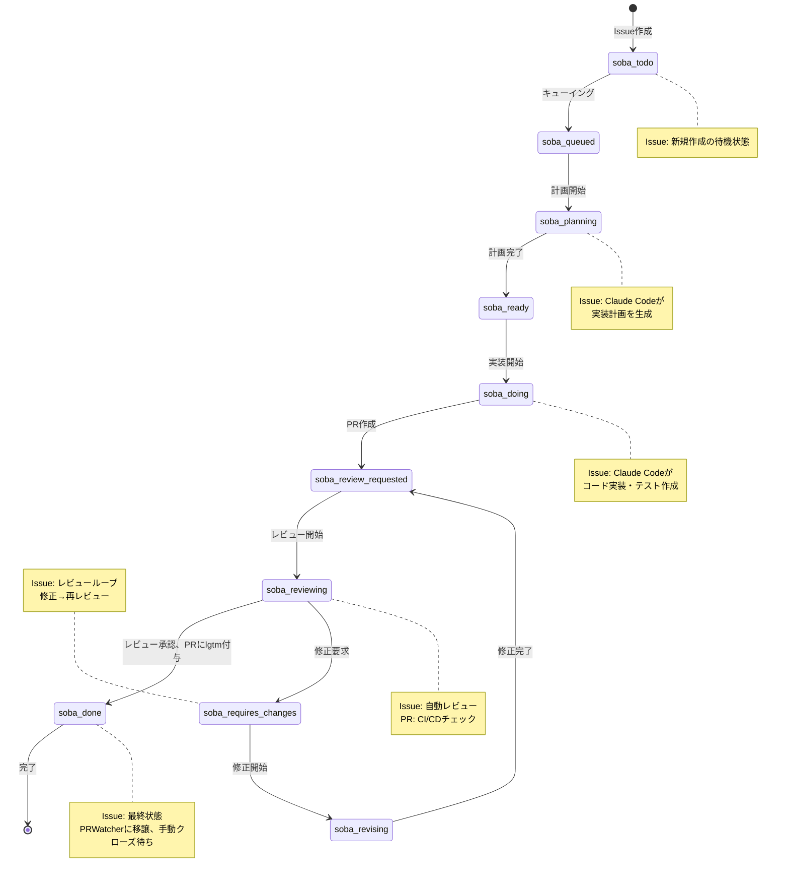
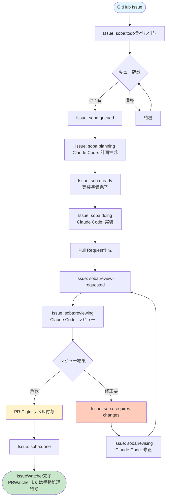

# AIドリブン開発ワークフロー

## ワークフローフェーズ

### 1. Todo (待機)
**ラベル**: `soba:todo`
**状態**: 新規作成されたIssue
**アクション**:
- Issueの検出
- 優先度判定（Issue番号順）
- キューへの追加準備

### 2. Queue (キューイング)
**ラベル遷移**: `soba:todo` → `soba:queued`
**アクション**:
- 実行キューへの追加
- 依存関係チェック
- リソース確認

### 3. Plan (計画)
**ラベル遷移**: `soba:queued` → `soba:planning` → `soba:ready`
**アクション**:
- Claude Codeによる要件分析
- 実装計画の生成
- 技術的アプローチの決定
**出力**: 実装計画（Issueコメント）

### 4. Implement (実装)
**ラベル遷移**: `soba:ready` → `soba:doing` → `soba:review-requested`
**アクション**:
- Git worktree作成
- 専用tmuxセッション起動
- Claude Codeによるコード実装
- テスト作成・実行
- Pull Request作成
**出力**: Pull Request

### 5. Review (レビュー)
**ラベル遷移**: `soba:review-requested` → `soba:reviewing`
**アクション**:
- Claude Codeによる自動レビュー
- CI/CDパイプライン実行
- 品質チェック
**判定**:
- 承認 → PRに`soba:lgtm`ラベル付与 → `soba:done`へ
- 修正必要 → `soba:requires-changes`へ

### 6. Revise (修正)
**ラベル遷移**: `soba:requires-changes` → `soba:revising` → `soba:review-requested`
**アクション**:
- レビューフィードバックの適用
- コード修正
- 再テスト
**出力**: 更新されたPR（レビューループへ）

### 7. Done (完了)
**ラベル遷移**: `soba:done`（PRに`soba:lgtm`ラベル付き）
**アクション**:
- マージ準備完了
- 最終確認
- PRWatcherへの処理権限移譲
- Issue処理の完了（手動でIssueクローズまたは将来のPRWatcher実装による自動マージ）

## ラベル状態遷移図

## ワークフロー詳細図

## 処理戦略

### シーケンシャル処理
- **1Issue 1プロセス**: 常に1つのIssueのみを処理
- **完全逐次実行**: 現在のIssueが完了するまで次のIssueは待機
- **並列実行なし**: 複数Issueの同時処理は行わない

### リソース管理
- tmuxセッション: 1つのアクティブセッション
- セッション名形式: `soba-issue-{番号}-{フェーズ}`
- Git worktree: `.git/soba/worktrees/issue-{番号}`
- 完了時にリソースを完全クリーンアップ

## Issue処理順序

### 処理ルール
1. Issue番号の小さい順に1つずつ処理
2. 現在のIssueが`soba:done`に到達するか`closed`になるまで待機
3. 完了後に次のIssueへ移行（PRWatcherまたは手動処理に移譲）

### スキップ条件
- 依存Issueが未完了
- 手動介入が必要なラベル付き
- エラーによる処理中断

## 管理ラベル一覧

sobaが自動的に管理するGitHubラベルの一覧です。これらのラベルは`soba init`コマンドの実行時に自動作成されます。

| ラベル名 | カラー | 説明 | 使用フェーズ |
|---------|-------|------|-------------|
| `soba:todo` |  `#e1e4e8` | 新規Issue・処理待機中 | Todo |
| `soba:queued` |  `#fbca04` | 実行キューに追加済み | Queue |
| `soba:planning` |  `#d4c5f9` | Claude Codeによる実装計画作成中 | Plan |
| `soba:ready` |  `#0e8a16` | 実装計画完了・実装準備完了 | Plan |
| `soba:doing` |  `#1d76db` | Claude Codeによる実装作業中 | Implement |
| `soba:review-requested` |  `#f9d71c` | PR作成済み・レビュー待機中 | Review |
| `soba:reviewing` |  `#a2eeef` | Claude Codeによるレビュー中 | Review |
| `soba:done` |  `#0e8a16` | レビュー承認済み・IssueWatcher処理完了 | Done |
| `soba:requires-changes` |  `#d93f0b` | レビューで修正要求・修正待機中 | Revise |
| `soba:revising` |  `#ff6347` | Claude Codeによる修正作業中 | Revise |

### ラベル管理について

- **自動作成**: `soba init`コマンド実行時に全ラベルが自動作成されます
- **重複回避**: 既存ラベルは作成をスキップし、新しいラベルのみ作成されます
- **一貫性**: カラーコードと説明文は実装に固定され、一貫性が保たれます
- **手動管理禁止**: これらのラベルは soba により自動管理されるため、手動での変更は推奨されません