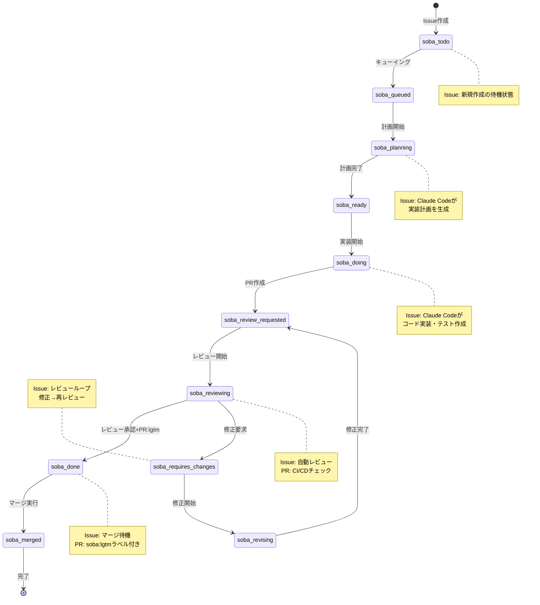
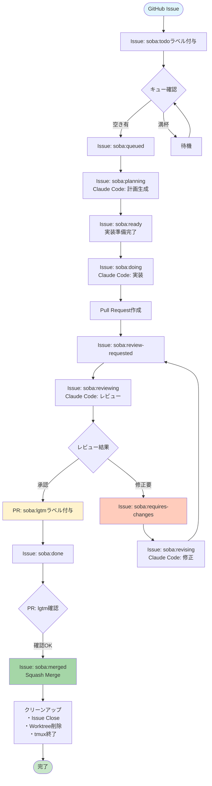

# AIドリブン開発ワークフロー

## ワークフローフェーズ

### 1. Todo (待機)
**ラベル**: `soba:todo`
**状態**: 新規作成されたIssue
**アクション**:
- Issueの検出
- 優先度判定（Issue番号順）
- キューへの追加準備

### 2. Queue (キューイング)
**ラベル遷移**: `soba:todo` → `soba:queued`
**アクション**:
- 実行キューへの追加
- 依存関係チェック
- リソース確認

### 3. Plan (計画)
**ラベル遷移**: `soba:queued` → `soba:planning` → `soba:ready`
**アクション**:
- Claude Codeによる要件分析
- 実装計画の生成
- 技術的アプローチの決定
**出力**: 実装計画（Issueコメント）

### 4. Implement (実装)
**ラベル遷移**: `soba:ready` → `soba:doing` → `soba:review-requested`
**アクション**:
- Git worktree作成
- 専用tmuxセッション起動
- Claude Codeによるコード実装
- テスト作成・実行
- Pull Request作成
**出力**: Pull Request

### 5. Review (レビュー)
**ラベル遷移**: `soba:review-requested` → `soba:reviewing`
**アクション**:
- Claude Codeによる自動レビュー
- CI/CDパイプライン実行
- 品質チェック
**判定**:
- 承認 → PRに`soba:lgtm`ラベル付与 → `soba:done`へ
- 修正必要 → `soba:requires-changes`へ

### 6. Revise (修正)
**ラベル遷移**: `soba:requires-changes` → `soba:revising` → `soba:review-requested`
**アクション**:
- レビューフィードバックの適用
- コード修正
- 再テスト
**出力**: 更新されたPR（レビューループへ）

### 7. Done (完了)
**ラベル遷移**: `soba:done`（PRに`soba:lgtm`ラベル付き）
**アクション**:
- マージ準備完了
- 最終確認

### 8. Merge (マージ)
**ラベル遷移**: `soba:done` → `soba:merged`
**アクション**:
- Squash merge実行（PR`soba:lgtm`ラベル確認後）
- Issue自動クローズ
- worktree削除
- tmuxセッションクリーンアップ

## ラベル状態遷移図

## ワークフロー詳細図

## 並行処理戦略

### 同時実行制限
- 最大並行Issue数: 5
- フェーズ別制限:
  - Planning: 3
  - Implementing: 2
  - Reviewing: 無制限

### リソース管理
- tmuxセッション: Issue×フェーズごとに独立
- セッション名形式: `soba-issue-{番号}-{フェーズ}`
- Git worktree: `.git/soba/worktrees/issue-{番号}`
- メモリ制限: セッションあたり2GB

## Issue優先度処理

### 処理順序
1. Issue番号の小さい順に処理
2. 同時実行数の制限内で並行処理
3. ブロッキング検出時は次のIssueへ

### スキップ条件
- 依存Issueが未完了
- リソース不足
- 手動介入が必要なラベル付き